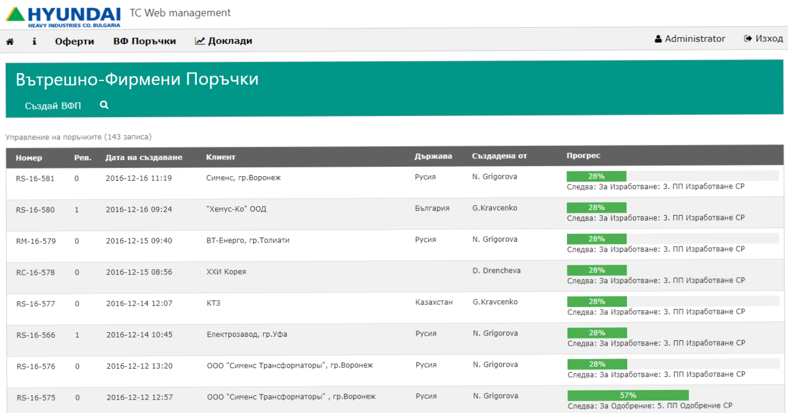
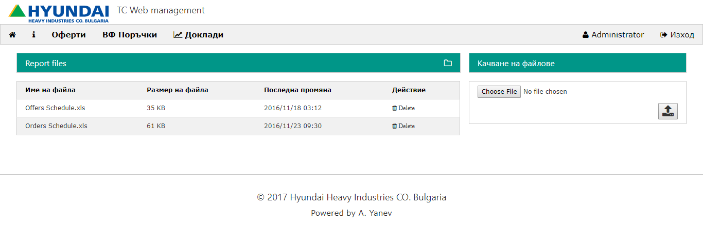
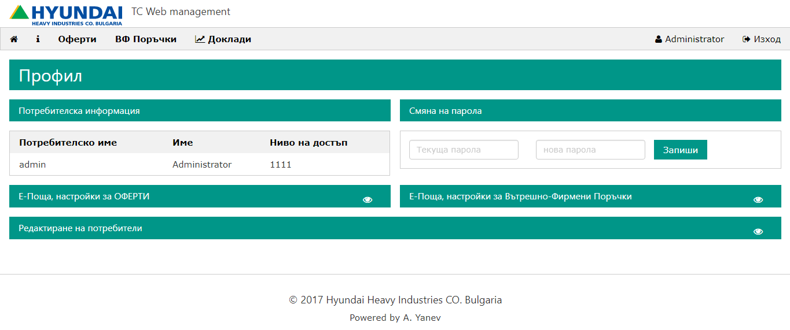
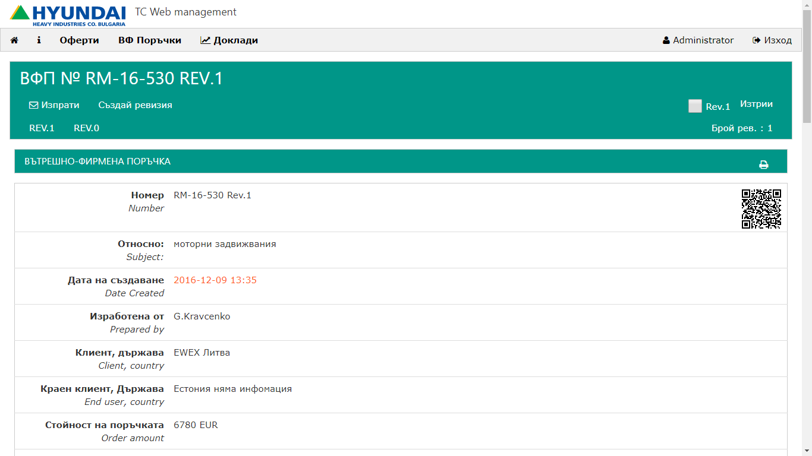
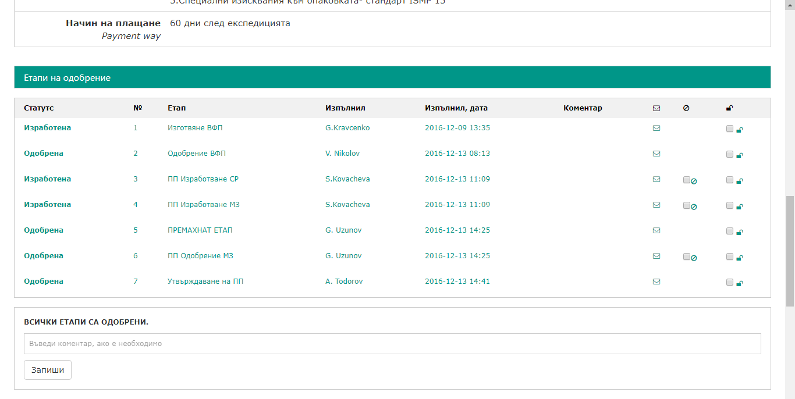
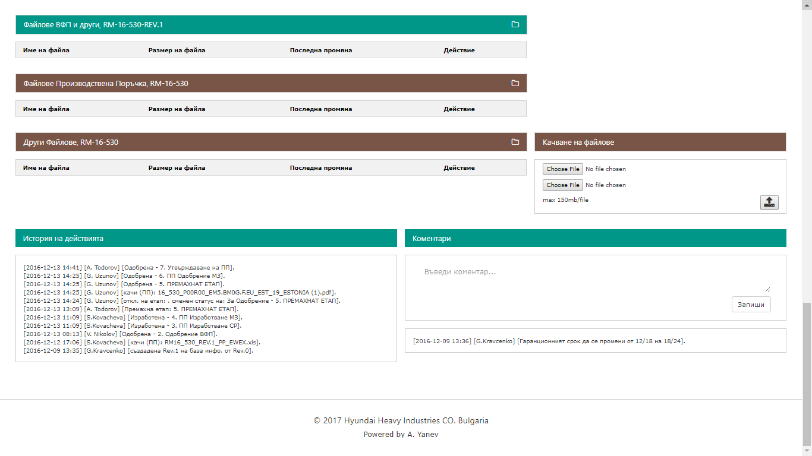
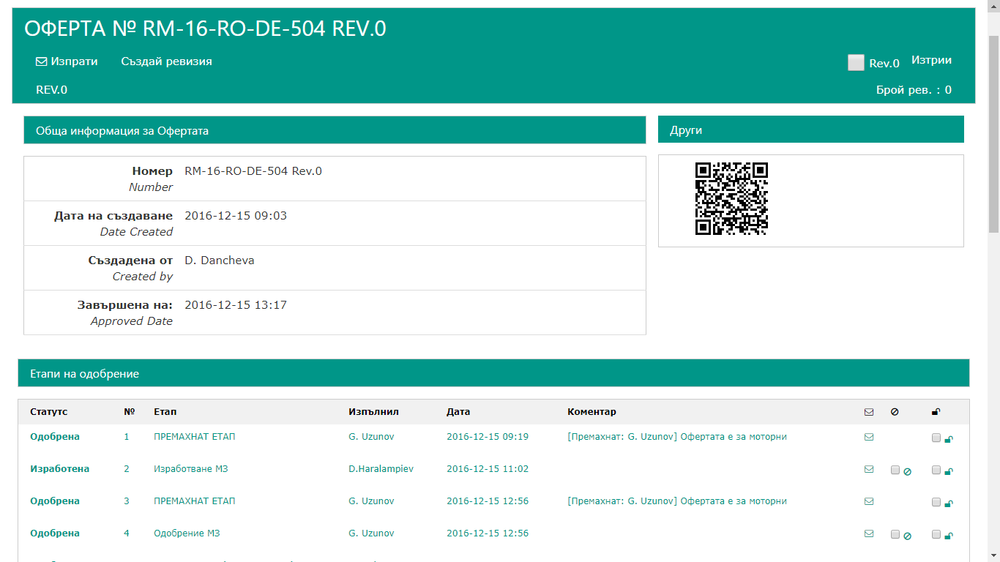
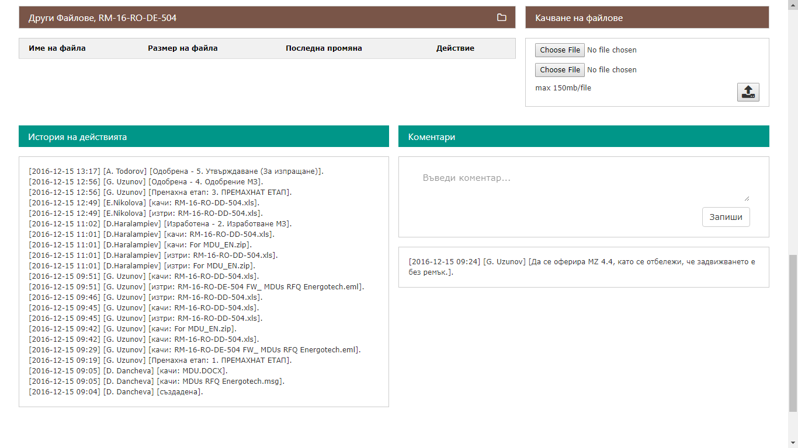

HHIB WEB MANAGEMENT <a href="http://www.hhi-co.bg/en"></a> 
======
<!-- 
[](http://hhib.azurewebsites.net/) -->


### Description
Content management system for "Tap Changers" devision. 
The application is designed to store information, files and monitoring the process for creating internal company orders and offers. Аpplication has features like: file upload, role based users, order and offers progress tracking, approval statuses, reports and MS Excel integration.

More information and futures available in [User guide](https://github.com/atanasyanew/HHIB/tree/master/docs/Instruction_web_management.pdf)

### Installation
The application is containerized with Docker
```
docker-compose build
docker-compose up
```

- Application url:  **http://localhost:8002**, credentials: 
	- username: **admin**
	- password: **admin**

- phpMyAdmin **http://localhost:8000**, credentials:
	- username: **user**
	- password: **test**

### Screenshots
















